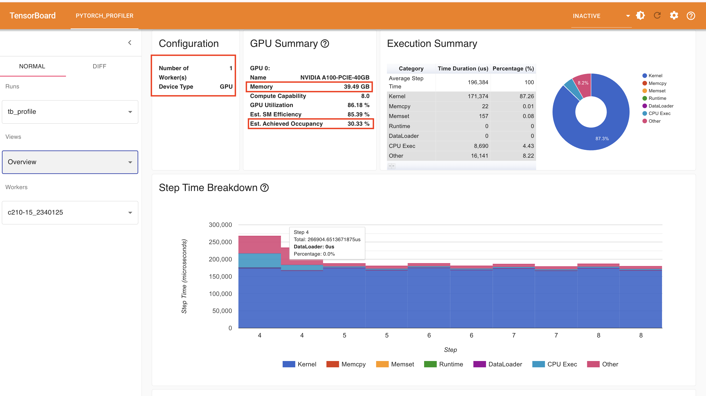
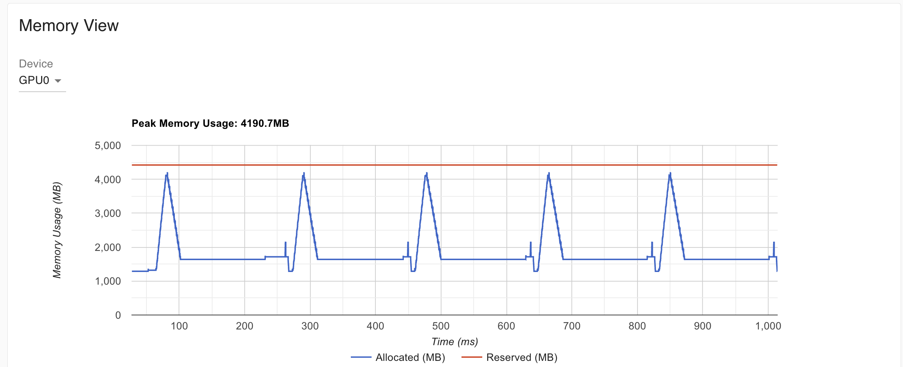
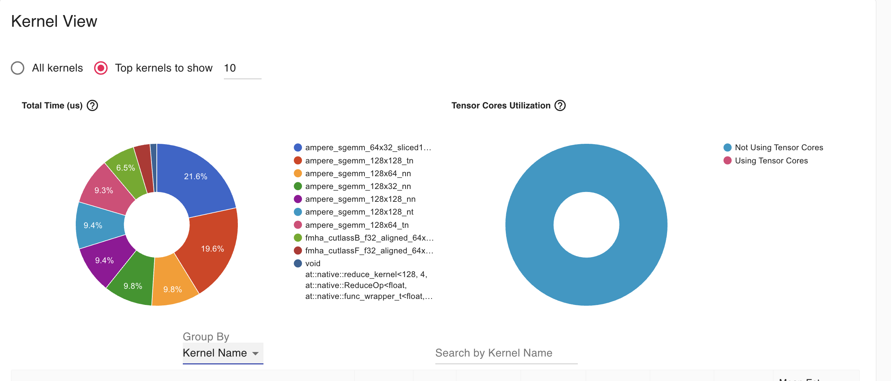

# LabAI-HPCTools
## BASELINE - Deliverable 1
### Key contents
The baseline implementation is obtained from the following repo: https://github.com/huggingface/transformers/tree/main/examples/pytorch/question-answering
### Hugging face repo
#### run_qa.py
This file is in charge of the full training workflow of BERT-uncased model using SQUAD dataset. The script supports different training configurations via several arguments handled by `HfArgumentParser` class. For this purpose 3 python classes are created: 
- `ModelArguments`: Selects the model and tokenizer and defines their configuration.
- `DataTrainingArguments`: configures the training dataset (in this case SQUAD v1.0).
- `TrainingArguments`: Imported from transformers library, required by source repo. 

```python
    parser = HfArgumentParser((ModelArguments, DataTrainingArguments, TrainingArguments))
```
#### 1. Loading dataset and model
This script programs automatically sets up the training with SQUAD dataset directly from the `datasets` library. It also provides support for personal datasets, handled by the alternative if branch.
```python
if data_args.dataset_name is not None:
        # Downloading and loading a dataset from the hub.
        raw_datasets = load_dataset(
            data_args.dataset_name,
            data_args.dataset_config_name,
            cache_dir=model_args.cache_dir,
            token=model_args.token,
            trust_remote_code=model_args.trust_remote_code,
        )
```
Regarding the model, config extracts the previous loaded arguments before the model and tokenizer are instantiated:
```python
config = AutoConfig.from_pretrained(
        model_args.config_name if model_args.config_name else model_args.model_name_or_path,
        cache_dir=model_args.cache_dir,
        revision=model_args.model_revision,
        token=model_args.token,
        trust_remote_code=model_args.trust_remote_code,
    )
    tokenizer = AutoTokenizer.from_pretrained(
        model_args.tokenizer_name if model_args.tokenizer_name else model_args.model_name_or_path,
        cache_dir=model_args.cache_dir,
        use_fast=True,
        revision=model_args.model_revision,
        token=model_args.token,
        trust_remote_code=model_args.trust_remote_code,
    )
    model = AutoModelForQuestionAnswering.from_pretrained(
        model_args.model_name_or_path,
        from_tf=bool(".ckpt" in model_args.model_name_or_path),
        config=config,
        cache_dir=model_args.cache_dir,
        revision=model_args.model_revision,
        token=model_args.token,
        trust_remote_code=model_args.trust_remote_code,
    )
```
#### 2. Preprocessing
In this stage, the script transforms the questions and paragraphs in BERT-format. The function `def prepare_train_features(examples)` is in charge of that.

#### 3. Training and evaluation
We use `QuestionAnsweringTrainer`, an adaptation of `Trainer` class of `transformers` library, customized by HuggingFace in this repo (`trainer_qa.py` file).
`trainer.train()` executes the training with the hardware resources allocated by the job `run_baseline.sh`.
```python
    # Initialize our Trainer
    trainer = QuestionAnsweringTrainer(
        model=model,
        args=training_args,
        train_dataset=train_dataset if training_args.do_train else None,
        eval_dataset=eval_dataset if training_args.do_eval else None,
        eval_examples=eval_examples if training_args.do_eval else None,
        processing_class=tokenizer,
        data_collator=data_collator,
        post_process_function=post_processing_function,
        compute_metrics=compute_metrics,
    )

    # Training
    if training_args.do_train:
        checkpoint = None
        if training_args.resume_from_checkpoint is not None:
            checkpoint = training_args.resume_from_checkpoint
        train_result = trainer.train(resume_from_checkpoint=checkpoint) <- TRAINING STARTS
        trainer.save_model()  # Saves the tokenizer too for easy upload

        metrics = train_result.metrics
        max_train_samples = (
            data_args.max_train_samples if data_args.max_train_samples is not None else len(train_dataset)
        )
        metrics["train_samples"] = min(max_train_samples, len(train_dataset))

        trainer.log_metrics("train", metrics)
        trainer.save_metrics("train", metrics)
        trainer.save_state()
```
Finally, the model evaluates its performance on the validation dataset with `trainer.evaluate()`.
```python
# Evaluation
    if training_args.do_eval:
        logger.info("*** Evaluate ***")
        metrics = trainer.evaluate()

        max_eval_samples = data_args.max_eval_samples if data_args.max_eval_samples is not None else len(eval_dataset)
        metrics["eval_samples"] = min(max_eval_samples, len(eval_dataset))

        trainer.log_metrics("eval", metrics)
        trainer.save_metrics("eval", metrics)
```
The remainder of the file handles the post-processing of the predictions.

#### trainer_qa.py
A provided repository script containing `QuestionAnsweringTrainer`, a specialized subclass of transformers library 's `Trainer` for Question-Answering tasks. It overrides the `evaluate()` and `predict()` function to allow metric computation on processed text.

#### utils_qa.py
Another provided repository script containing post-processing functions needed by the `QuestionAnsweringTrainer`. Its main objective is to post-process the model's predictions and convert them to answers that are substrings of the original text.

### SLURM jobs
These are the jobs executed into Finisterrae 3. The first one is the baseline training job(`run_baseline.sh`), responsible of activating the Python environment and install dependencies needed from Hugging face repository (found in `requirements.txt`). Finally, a code profiling job (`run_profiling.sh`) was created and executed with tensorboard.

#### run_baseline.sh
The training is executed with the following hyperparameters: a batch size of 12 examples, learning rate 3x10^-5 for the Adam optimizer (default optimizer used when no specific one is passed), 2 epochs, and  a maximum 384 token length that BERT can processed at the same time. If 384 tokens are exceeded , they are split using a document stride of 128 tokens.
```python
perf stat python run_qa.py \
  --model_name_or_path google-bert/bert-base-uncased \
  --dataset_name rajpurkar/squad \
  --do_train \
  --do_eval \
  --per_device_train_batch_size 12 \
  --learning_rate 3e-5 \
  --num_train_epochs 2 \
  --max_seq_length 384 \
  --doc_stride 128 \
  --output_dir /tmp/debug_squad/
```

#### run_profiling.sh
This job is similar to the baseline, except for the number of epochs and the size of the dataset. We restrict the dataset to 1000 examples and run only 1 epoch to make a profiling, to avoid using unnecessary resources while still capturing overall perfomance metrics. In addition, metrics are saved into the TensorBoard data folder every 50 steps.
```python
perf stat python run_qa.py \
  --model_name_or_path google-bert/bert-base-uncased \
  --dataset_name rajpurkar/squad \
  --do_train \
  --do_eval \
  --per_device_train_batch_size 12 \
  --learning_rate 3e-5 \
  --num_train_epochs 1 \
  --max_seq_length 384 \
  --max_train_samples 1000 \
  --doc_stride 128 \
  --output_dir ./profiling_v3/ \
  --report_to none \
  --logging_steps 10 \
  --eval_strategy steps \
  --eval_steps 50 \
```
We also added the Pytorch profiler to the `run_qa.py` file:
```python
import torch
from torch.profiler import profile, ProfilerActivity, schedule, tensorboard_trace_handler

class ProfilerCallback(TrainerCallback):
    def __init__(self, profiler):
        self.profiler = profiler

    def on_step_end(self, args, state, control, **kwargs):
        self.profiler.step()

[...]

    if training_args.do_train:
        checkpoint = None
        if training_args.resume_from_checkpoint is not None:
            checkpoint = training_args.resume_from_checkpoint
        # Profiler config
        prof = profile(
            activities=[ProfilerActivity.CPU, ProfilerActivity.CUDA],
            schedule=schedule(wait=2, warmup=2, active=5, repeat=1),
            on_trace_ready=tensorboard_trace_handler(training_args.output_dir + "/tb_profile"),
            record_shapes=True,
            profile_memory=True,
            with_stack=False
        )
        
        prof.start()
        trainer.add_callback(ProfilerCallback(prof))
        
        train_result = trainer.train(resume_from_checkpoint=checkpoint)
        
        prof.stop()
```

### Reporting training times
Training setup:
- Hardware: 1 node, 32 cores, 64 GB of mem and 1 GPU NVIDIA A100
- Software: `run_qa.py`
- Model and dataset: BERT uncased and SQUAD v1.0
- Hyperparameters: 
    - Batch size: 12
    - Epochs: 2
    - Learning rate: 3e-5
    - Max sequence length: 384
    - Doc. stride = 128


| | Time (min) | Samples/s | achieved TFLOP/s | training loss
| :--- | :--- | :--- | | :--- |
| **Training** | 49:06.61 | 60.063 | 10.96 | 0.9787
| **Evaluation** | 1:03.46 | 169.42 |      |

With `perf stat`, the following metrics are obtained:
```
        3028674.07 msec task-clock:u              #    0.985 CPUs utilized          
                 0      context-switches:u        #    0.000 K/sec                  
                 0      cpu-migrations:u          #    0.000 K/sec                  
           1505223      page-faults:u             #    0.497 K/sec                  
     8357903391414      cycles:u                  #    2.760 GHz                    
    22065735623424      instructions:u            #    2.64  insn per cycle         
     4203951612527      branches:u                # 1388.050 M/sec                  
        3894672210      branch-misses:u           #    0.09% of all branches        

    3073.851744782 seconds time elapsed

    2995.507597000 seconds user
      25.054931000 seconds sys
```
Although 32 CPU cores were requested in the SLURM job, only 0.985 CPUs are utilized in avarage. This means that GPU is idle most of the time, which is highly innefficient. This underutilization is confirmed by the elapsed time. One of the main reasons is the small batch size (12), which fails to exploit the A100 computational power. Another bottle neck is that only one process is in charge of loading the data (`dataloader_num_workers=0` in the `run_qa.py`log script).

### Profiling
Tensorboard is also used for hardware profiling. For this analysis, a smaller training is executed: 1 epoch and 1000 examples.

The overview confirms the bottle necks identified earlier:
- Only one worker is used
- The underutilization of GPU memory


The Memory view shows a peak utilization of 4190.7MB, wasting the 246GB available on a A100 node.


This graphic shows Tensor cores are not being utilized because FP32 is used instead of FP16 ((`fp16=False`)). This should be change to actually activate the hardware acceleration and increase the TFLOPS/s.


### Conclusions
The combined analysis of executions times, `perf stat`'s output and Tensorboard profile view corroborates the performance bottlenecks present in the baseline.
There are three main critical issues:
-  GPU Memory underutilization: The configured 12 batch size is insufficient for NVIDIA A100. So the solution must be increase the batch size as much as GPU's RAM allow us in order to process more samples.
- Sequential operation. Despite requesting 32 cores the training is executed sequentially. This forces GPU to constantly wait for CPU. We must enable parallelism by setting dataloader_num_workers with `run_qa.py` arguments to a higher value. Or maybe reduce the cores allocation to avoid asking for more hardware than neccesary.
- Tensor cores unused: FP32 is used so the kernel is not utilizing GPU's tensor cores. FP16 must be implmented to activate this specialized hardware and exploit it.